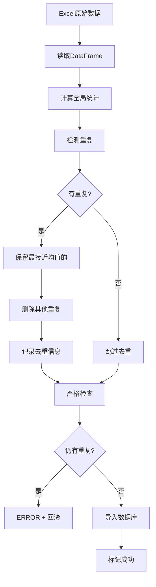

# 智能去重技术详解

## 📋 目录

1. [问题背景](#问题背景)
2. [设计思路](#设计思路)
3. [技术方案](#技术方案)
4. [实现细节](#实现细节)
5. [使用说明](#使用说明)
6. [FAQ](#faq)

---

## 问题背景

### 遇到的问题

在导入Excel数据时，经常遇到**同一股票代码出现多次**的情况：

```
行1391  300614  百川畅银  分数: 2.5    ← 重复1
行1393  300614  百川畅银  分数: -8.4   ← 重复2（正确的）
```

### 传统方案的局限

**方案1：直接报ERROR回滚**
- ❌ 需要手动修改Excel
- ❌ 效率低，影响自动化流程
- ❌ 容易漏掉异常数据

**方案2：基于局部环境的去重**
- ❌ 只看周围5行数据
- ❌ 如果周围数据本身就很分散，标准差大，偏离度被"稀释"
- ❌ 无法准确识别真正的异常值

**示例：局部环境失效的情况**
```
周围数据: [2.5, -13.7, 3.0, -13.7, 2.5]
标准差: 很大
重复项: 2.5 vs -8.4
→ 偏离度都很小，无法判断删除哪个
```

---

## 设计思路

### 核心理念

**当且仅当一个股票出现重复时，保留最接近全局均值的那条，删除其他。**

### 为什么这样设计？

1. **全局视角** - 基于整个数据集的统计特征，不受局部波动影响
2. **简单有效** - 不需要复杂的阈值调整，逻辑清晰
3. **自动化** - 完全自动处理，无需人工干预
4. **可追溯** - 详细记录去重过程，JSON保存完整信息

### 离群值检测原理

```
全局均值: μ = -4.11
全局标准差: σ = 9.08

重复记录:
- 记录A: 2.50   距离 = |2.50 - (-4.11)| = 6.61
- 记录B: -8.40  距离 = |-8.40 - (-4.11)| = 4.29

→ 保留记录B（-8.40），删除记录A（2.50）
```

---

## 技术方案

### 整体架构

```
┌─────────────────────────────────────────────┐
│         Excel文件（含重复数据）              │
└──────────────────┬──────────────────────────┘
                   │
                   ↓
┌─────────────────────────────────────────────┐
│    1. 读取Excel到DataFrame                   │
│       总记录: 5434条                         │
└──────────────────┬──────────────────────────┘
                   │
                   ↓
┌─────────────────────────────────────────────┐
│    2. 智能去重（DataDeduplicator）           │
│       - 计算全局统计（μ, σ）                │
│       - 检测重复代码                         │
│       - 保留最接近均值的                     │
│       - 删除其他重复项                       │
└──────────────────┬──────────────────────────┘
                   │
                   ↓
┌─────────────────────────────────────────────┐
│    3. 记录去重信息到JSON                     │
│       dedup_info: {                          │
│         detected_duplicates: [...]           │
│         removed_count: 5                     │
│         removed_details: [...]               │
│       }                                      │
└──────────────────┬──────────────────────────┘
                   │
                   ↓
┌─────────────────────────────────────────────┐
│    4. 严格检查（确保无重复）                 │
│       if 仍有重复:                           │
│         ERROR + 回滚                         │
└──────────────────┬──────────────────────────┘
                   │
                   ↓
┌─────────────────────────────────────────────┐
│    5. 批量导入数据库                         │
│       导入: 5429条（去重后）                 │
└─────────────────────────────────────────────┘
```

### 数据流



---

## 实现细节

### 核心算法

```python
def _select_rows_to_remove(df, dup_rows, code):
    """
    基于全局离群值检测的去重算法
    """
    # 1. 计算全局统计
    global_mean = df['总分'].mean()
    global_std = df['总分'].std()
    
    # 2. 计算每条重复记录与全局均值的距离
    dup_info = []
    for idx, row in dup_rows.iterrows():
        distance = abs(row['总分'] - global_mean)
        z_score = distance / global_std
        dup_info.append({
            'index': idx,
            'distance': distance,
            'z_score': z_score
        })
    
    # 3. 保留最接近均值的，删除其他
    closest = min(dup_info, key=lambda x: x['distance'])
    to_remove = [d['index'] for d in dup_info 
                 if d['index'] != closest['index']]
    
    return to_remove
```

### 关键特性

#### 1. 列名兼容性

支持多种Excel列名格式：
- `总分` （推荐）
- `综合评分`
- `score`

```python
for col_name in ['总分', '综合评分', 'score']:
    if col_name in df.columns:
        score_col = col_name
        break
```

#### 2. 灯下黑问题修复

确保临时列清理干净，避免干扰后续检查：

```python
# 去重前：清理可能存在的临时列
if '代码_normalized' in df.columns:
    df = df.drop(columns=['代码_normalized'])

# 去重后：再次清理
if '代码_normalized' in df_cleaned.columns:
    df_cleaned = df_cleaned.drop(columns=['代码_normalized'])
```

#### 3. 原始数据保护

**设计决策：不修改Excel文件**

**优点：**
- ✅ 保护原始数据完整性
- ✅ 可追溯、可审计
- ✅ 重新导入时自动执行去重
- ✅ 如果去重逻辑有问题，原始数据还在

**工作流程：**
```
Excel(含重复) → 内存去重 → 数据库(无重复)
                  ↓
            JSON记录详情
```

---

## 使用说明

### 基本使用

```bash
# 导入数据（自动去重）
python update_daily_data.py import

# 跳过文件扫描
python update_daily_data.py import --skip-scan
```

### 查看去重结果

```bash
# 运行检查脚本
python check_dedup.py
```

**输出示例：**
```
======================================================================
去重详情
======================================================================
检测到重复的代码: ['300614', '002909', '300695', '300848', '300686']
删除数量: 5

删除详情:
  • 300614(百川畅银) 行1391
    分数: 2.50, 全局均值: -4.11
    距离: 6.61, Z-score: 0.73
    原因: 重复记录中偏离全局均值较远（保留最接近均值的）

  • 002909(集泰股份) 行1562
    分数: -12.50, 全局均值: -4.11
    距离: 8.39, Z-score: 0.92
    原因: 重复记录中偏离全局均值较远（保留最接近均值的）
    
...
```

### JSON记录结构

```json
{
  "20251107": {
    "status": "success",
    "dedup_info": {
      "detected_duplicates": ["300614", "002909", "300695", "300848", "300686"],
      "removed_count": 5,
      "removed_details": [
        {
          "code": "300614",
          "name": "百川畅银",
          "rank": 1391,
          "total_score": 2.50,
          "global_mean": -4.11,
          "distance_from_mean": 6.61,
          "z_score": 0.73,
          "reason": "重复记录中偏离全局均值较远（保留最接近均值的）"
        }
      ],
      "dedup_time": "2025-11-08T00:17:52.581234"
    }
  }
}
```

---

## FAQ

### Q1: 为什么不修改Excel文件？

**A:** 保护原始数据的完整性和可追溯性。去重是在内存中进行的，导入数据库时已经是干净的数据。如果需要修改Excel，可以：

1. 修复上游生成脚本的bug
2. 使用 `check_dedup.py` 查看去重详情，手动编辑Excel
3. 联系开发者添加 `--clean-excel` 选项

### Q2: 如果去重逻辑误删了正确数据怎么办？

**A:** 
1. Excel原始文件未修改，可以随时恢复
2. JSON记录了完整的去重详情，可以追溯
3. 可以修改 `deduplicate_helper.py` 的逻辑，重新导入

### Q3: 全局均值方法适用于所有情况吗？

**A:** 是的。这个方法的优势：

- **鲁棒性强** - 不受局部数据波动影响
- **无需阈值** - 自动选择最优记录
- **简单直观** - 逻辑清晰，易于理解
- **普适性好** - 适用于各种分布的数据

### Q4: 如果两条重复记录距离全局均值相同怎么办？

**A:** Python的 `min()` 函数会返回第一个最小值，即保留排在前面的记录。这种情况极其罕见。

### Q5: 去重会影响导入性能吗？

**A:** 几乎无影响。去重是O(n)复杂度，对于5000条记录，耗时<0.1秒。

### Q6: 如何关闭智能去重？

**A:** 修改 `import_data_robust.py`，注释掉去重部分：

```python
# === 智能去重（只去除明显异常的重复）===
# from deduplicate_helper import DataDeduplicator, print_dedup_summary
# deduplicator = DataDeduplicator()
# df, dedup_stats = deduplicator.deduplicate_stock_data(df)
```

---

## 技术亮点

### 1. 算法创新

- **全局统计 vs 局部统计** - 解决了局部环境失效的问题
- **离群值检测** - 基于统计学原理，科学可靠
- **自适应选择** - 自动保留最优记录

### 2. 工程实践

- **原子性** - 配合事务回滚，保证数据一致性
- **可追溯** - JSON完整记录每次去重操作
- **向后兼容** - 老版本JSON自动升级
- **灯下黑修复** - 细节处理到位

### 3. 用户体验

- **自动化** - 无需人工干预
- **安全性** - 不修改原始Excel
- **透明度** - 详细日志和报告
- **可审计** - 随时追溯去重决策

---

## 总结

智能去重系统采用**全局离群值检测**方法，在保护原始数据的前提下，自动化处理Excel中的重复记录，确保导入数据库的数据干净、可靠。

**核心价值：**
- 🎯 **准确** - 基于全局统计，不受局部波动影响
- 🤖 **自动** - 完全自动化，无需人工干预
- 🛡️ **安全** - 不修改原始数据，可追溯
- 📊 **透明** - 详细记录每次去重操作

**适用场景：**
- ✅ Excel数据存在重复记录
- ✅ 需要自动化导入流程
- ✅ 需要保留原始数据完整性
- ✅ 需要追溯和审计去重决策

---

**文档版本:** v1.0  
**最后更新:** 2025-11-08  
**作者:** Cascade AI  
**项目:** 股票分析系统
